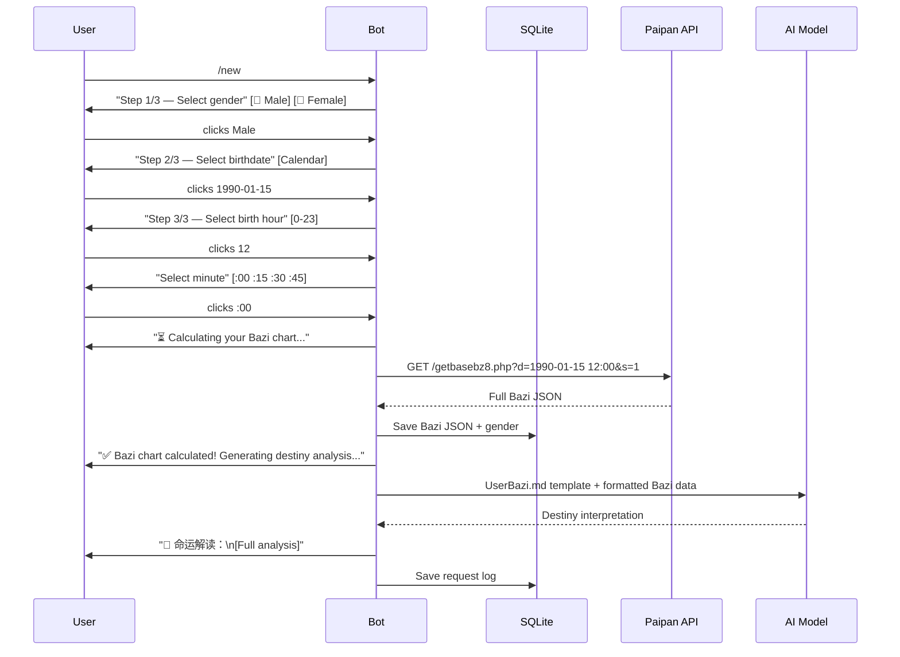

# Enhanced `/new` Command: Paipan API Integration + AI Destiny Interpretation

## Background

Currently, the `/new` command collects a user's birthdate + time via inline keyboard, stores a plain-text string like `"出生日期：1990-01-15 出生时间：12:00"` in the `bazi` column, and stops. The user must then use `/start` separately to get a daily reading that uses this minimal info.

**Goal**: After the user provides their birthdate + time (and a new gender input), automatically:

1. Call the **Paipan API** (`https://bzapi4.iwzbz.com/getbasebz8.php`) to convert their birth info into a full Bazi chart
2. **Store** the rich Bazi data in the database
3. **Merge** the Bazi data into the `UserBazi.md` prompt template
4. **Call the LLM** to generate a full destiny interpretation
5. **Return** the interpretation to the user in Telegram

## User Review Required

> [!IMPORTANT]
> **New Gender Input Step**: The Paipan API requires gender (`s=1` for male, `s=0` for female). The current `/new` flow does **not** collect gender. A new inline keyboard step will be added **before** the calendar picker: "Select Gender: 🧑 Male / 👩 Female".

> [!IMPORTANT]
> **API Dependency**: The external API at `https://bzapi4.iwzbz.com/getbasebz8.php` is a third-party service. If it goes down, the Bazi conversion will fail. Error handling with a graceful fallback message will be implemented.

> [!WARNING]
> **Long Response Time**: After the user selects their birth minute, the bot will: call the Paipan API → call the LLM → send the result. This could take 15-30 seconds. A "processing" message with typing indicator will be shown.

## Proposed Changes

### Component 1: Calendar/UI Module — Add Gender Picker

#### [MOAI Agent] [calendar.rs](file:///home/henius/src/AI AgentBaziWorkflow/src/calendar.rs)

Add a new `GenderAction` enum and `build_gender_picker()` function:

- New callback prefix: `bdgen` (birthdate gender)
- `GenderAction::Male { }` / `GenderAction::Female { }` / `GenderAction::Ignore`
- `build_gender_picker()` → inline keyboard with two buttons: `🧑 Male` / `👩 Female`
- `is_gender_picker_callback()` helper

---

### Component 2: Paipan API Client — New Module

#### [NEW] [paipan.rs](file:///home/henius/src/AI AgentBaziWorkflow/src/paipan.rs)

New module to call the external Paipan API and format the response:

- **`fetch_bazi_chart(client, date, hour, minute, gender) → AppResult<BaziChart>`**
  - Calls `GET https://bzapi4.iwzbz.com/getbasebz8.php?d={YYYY-MM-DD HH:MM}&s={0|1}&today=undefined&vip=0&userguid=&yzs=0`
  - Parses the JSON response into a `BaziChart` struct
- **`BaziChart` struct** containing:
  - `bz`: Four pillars (year/month/day/hour stems & branches)
  - `ss`: Ten Gods array
  - `cg` / `cgss`: Hidden stems and their ten gods
  - `ny`: Nayin for each pillar
  - `dayun`: Great Luck cycles
  - `szshensha` / `dyshensha`: Shen Sha details
  - `kongwang`: Kong Wang (空亡)
  - `taixi`, `taiyuan`, `minggong`, `shenggong`: Special palace info
  - `lunar_date`: The lunar date string from `bz["8"]`
  - `sex`: Gender
- **`format_bazi_for_prompt(chart: &BaziChart) → String`**
  - Formats the chart into a readable Chinese text block suitable for merging into the `UserBazi.md` prompt template
  - Example output:
    ```
    性别：男
    公历出生：1990-01-15 12:00
    农历：1989年腊月十九 午时
    四柱：己巳年 丁丑月 庚辰日 壬午时
    十神：正印 正官 日主 食神
    纳音：大林木(年) 涧下水(月) 白蜡金(日) 杨柳木(时)
    藏干：[丙(七杀) 庚(比肩) 戊(偏印)] [己(正印) 癸(伤官) 辛(劫财)] ...
    空亡：申酉
    大运：丙子 乙亥 甲戌 癸酉 壬申 辛未 庚午 己巳 ...
    起运岁数：4岁
    四柱神煞：天罗地网 劫煞 | 太极贵人 天乙贵人 华盖 | ...
    胎息：乙酉(泉中水)  胎元：戊辰(大林木)
    命宫：甲戌(山头火)  身宫：壬申(剑锋金)
    ```
- **`format_bazi_for_storage(chart: &BaziChart) → String`**
  - Returns the JSON string of the full API response for DB storage (preserves all data)

---

### Component 3: LLM Destiny Module — New Function

#### [MOAI Agent] [llm_bazi.rs](file:///home/henius/src/AI AgentBaziWorkflow/src/llm_bazi.rs)

Add a new function for destiny interpretation (separate from the daily reading):

- **`generate_destiny_reading(http_client, user_bazi_text, api_key, api_base, model_name) → AppResult<String>`**
  - Loads the `UserBazi.md` template via `include_str!("../prompts/UserBazi.md")`
  - Replaces the `{user bazi info}` placeholder with the formatted Bazi text
  - Sends the full prompt to the LLM as the system message, with a simple user message requesting analysis
  - Returns the LLM's destiny interpretation

---

### Component 4: Handler Flow — Wire Everything Together

#### [MOAI Agent] [handlers.rs](file:///home/henius/src/AI AgentBaziWorkflow/src/handlers.rs)

**Updated `/new` command flow** (3 steps instead of 2):

1. **Step 1/3 — Gender selection**: `/new` → show `build_gender_picker()`
2. **Step 2/3 — Date selection**: Gender selected → store gender in callback data → show `build_birthdate_calendar()`
3. **Step 3/3 — Time selection**: Date selected → hour picker → minute picker (same as now, but gender is threaded through callback data)
4. **On completion**: minute selected →
   - Show "⏳ Calculating your Bazi chart..." message
   - Call `paipan::fetch_bazi_chart()`
   - Format for prompt via `paipan::format_bazi_for_prompt()`
   - Format for storage via `paipan::format_bazi_for_storage()`
   - Save to DB via `db::save_or_update_user_bazi()`
   - Call `llm_bazi::generate_destiny_reading()` with the formatted Bazi
   - Send the destiny interpretation result to the user
   - If API/LLM fails: show error message but still save what we have

**Callback data threading**: Gender needs to be threaded through all subsequent callback data. Since the callbacks already carry `date` as a string, we'll append gender as a suffix: e.g., `bdcal:sel:1990:1:15:1` (last `:1` = male). Same for time picker callbacks.

> [!IMPORTANT]
> **Alternative approach**: Instead of threading gender through callback data (which risks hitting Telegram's 64-byte callback limit), we can use the in-memory `DashMap` to temporarily store the user's gender selection keyed by `user_id`. This is simpler and more robust. The gender will be persisted to DB along with the bazi data upon completion.

---

### Component 5: Database Updates

#### [MOAI Agent] [db.rs](file:///home/henius/src/AI AgentBaziWorkflow/src/db.rs)

- Update `save_or_update_user_bazi()` to also accept and save gender
- The `bazi` column will now store the **full JSON** from the Paipan API (instead of the plain "出生日期" text)
- Add `get_user_bazi()` already exists — no change needed, it returns the raw string

#### [NEW] [migrations/20260408000000_add_user_gender.sql](file:///home/henius/src/AI AgentBaziWorkflow/migrations/20260408000000_add_user_gender.sql)

```sql
ALTER TABLE users ADD COLUMN gender Boolean;
```

---

### Component 6: State Management

#### [MOAI Agent] [state.rs](file:///home/henius/src/AI AgentBaziWorkflow/src/state.rs)

Add a temporary `DashMap<i64, u8>` field `pending_gender` to store the user's gender selection between the gender picker and the final submission.

---

### Component 7: Module Registration

#### [MOAI Agent] [main.rs](file:///home/henius/src/AI AgentBaziWorkflow/src/main.rs)

Add `mod paipan;` declaration.

---

## Flow Diagram



## Open Questions

> [!IMPORTANT]
> **Telegram message length**: The destiny interpretation from the LLM could be very long (2000+ characters). Telegram has a 4096-character limit per message. Should we:
> Split into multiple messages if it exceeds the limit?

> [!NOTE]
> **Existing user bazi data**: Users who previously used `/new` have plain-text bazi data stored. The new format will be JSON. The `get_user_bazi()` function is already used by the daily reading — it will still work since it returns a raw string. However, the daily reading LLM prompt will now receive richer structured data for personalized readings. Ignore the backward compatible completely, i will clear all old data

## Verification Plan

### Automated Tests

1. `cargo build` — Ensure the project compiles successfully
2. `cargo clippy` — No warnings
3. Test the Paipan API integration manually:
   ```bash
   curl "https://bzapi4.iwzbz.com/getbasebz8.php?d=1990-01-15%2012:00&s=1&today=undefined&vip=0&userguid=&yzs=0"
   ```

### Manual Verification

1. Start the bot locally, send `/new`
2. Verify the 3-step flow: gender → date → time
3. Verify the Paipan API is called and Bazi data is stored in DB
4. Verify the LLM destiny interpretation is returned
5. Check the DB `users` table to confirm `bazi` column has full JSON and `gender` column is populated
6. Test error handling: temporarily break the API URL and verify graceful failure
